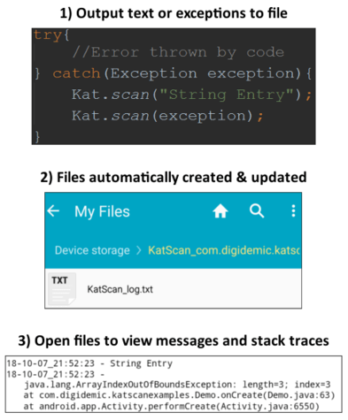
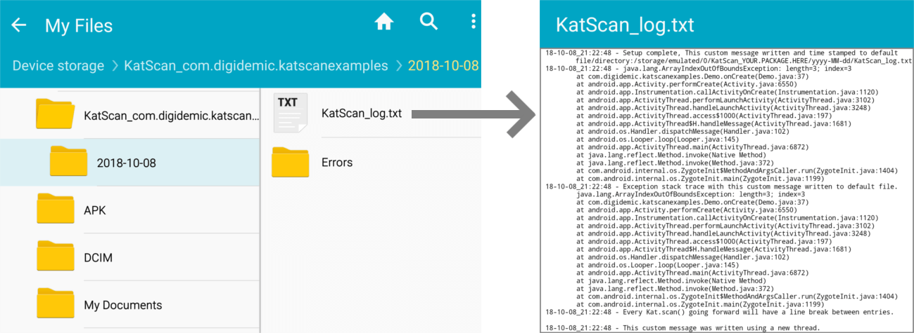

# KatScan

### Write timestamped logs, exceptions, stack traces, or any form of text to a file for Android debugging purposes.
- Simple single parameter one liners to write stack traces or messages to user defined directories/files and/or Logcat (Logcat only displays for debug builds).
- Released apps and APKs automatically disable KatScan by default (no need to comment out or delete for release builds).
- Ready to use out of the box yet fully customizable.
- Compatible with every Android version API 4 (Android 1.6, Donut) and higher.
  <br><br>
  

### Check out the [example app for KatScan](/example-katscan/)!

<br>

## Table of Contents
- [Examples](#examples)
- [Installation](#installation)
- [Syntax](#syntax)
- [Versioning](#versioning)
- [License](#license)

## Examples
#### The following [sample code](/example-katscan/) and screenshot output briefly demonstrates the setup and type of calls that can be made using KatScan.

```java
//Only pre-req call needed and only called once for the entirety of the application life!
Kat.setup(this); //" this" being Activity

//Pass in variables, exceptions, custom messages, or any form of text for KatScan to output to a separate file.
Kat.scan("Setup complete, This custom message written and time stamped to default file/directory:" +
        "/storage/emulated/0/KatScan_com.digidemic.katscanexamples/2018-09-30/KatScan_log.txt");
try{
    //Explicitly throw an error for this example
    String arrayOutOfBounds = new String[]{"KatScan", "error", "example"}[3];

} catch(Exception exception){

    //Pass in exception to have its full stack trace written to its default file.
    Kat.scan(exception);

    //Or have the exception stack trace be prefixed with a custom message.
    Kat.scan(exception, "Exception stack trace with this custom message written to default file.");

    //Or even have everything written to a new directory & file KatScan creates if does not already exist
    Kat.scan("/Errors/log", exception, "Exception stack trace with this custom message written to new subdirectory and file.");

}

//Dozens of configurable settings that can be updated at run-time
Kat.Config.File.lineBreakBetweenEachEntry = true;
Kat.scan("Every Kat.scan() going forward will have a line break between entries");
Kat.Config.createNewThreadForEachKatScanCall = true;
Kat.scan("This custom message was written using a new thread.");
```


<br>

## Installation

### Install with JitPack
[](https://jitpack.io/#Digidemic/katscan)
1) Add JitPack to your project's root `build.gradle` at the end of `repositories`:
- ```groovy
  dependencyResolutionManagement {
      repositoriesMode.set(RepositoriesMode.FAIL_ON_PROJECT_REPOS)
      repositories {
          mavenCentral()
          maven { url 'https://jitpack.io' }
    }
  }
  ```
2) In the `build.gradle` of the module(s) you wish to use KatScan with, add the following to `dependencies`:
- ```groovy
  dependencies {
      // Required: Installs the .aar without any documentation.
      implementation 'com.github.digidemic:katscan:1.1.0'
      
      // Optional: Displays documentation while writing coding. 
      implementation 'com.github.digidemic:katscan:1.1.0:javadoc'
      // Optional: Displays documentation (in some cases more comprehensive) and uncompiled code when stepping into library.
      implementation 'com.github.digidemic:katscan:1.1.0:sources'
  }
  ```
3) [Sync gradle](https://www.delasign.com/blog/how-to-sync-an-android-project-with-its-gradle-files-in-android-studio/) successfully.
4) Done! Your Android project is now ready to use KatScan. Go to [Examples](#examples) or [Syntax](#syntax) for KatScan usage!

<br>

## Syntax

### Setup / Pre-req call

#### Permissions
If installing with [JitPack installation](https://jitpack.io/#digidemic/kat-scan), this step can be skipped. Otherwise the following permission will need to be added to your module's `Manifest.xml`. This permission is needed for KatScan to write to external files.
```xml
<uses-permission android:name="android.permission.WRITE_EXTERNAL_STORAGE" />
```

<br>

#### Setup call
`Kat.setup()` is the only pre-req call needed and needs to be called just once for the entirety of the application's life. `Kat.setup()` needs to be called before the first `Kat.scan()` call anywhere Context (Or Activity) can be retrieved in your application. Consider passing in an active Activity in place of Context as devices using API 23 (Android Marshmallow) and higher will need to allow the "Storage" permission via popup. Because of this, it is highly recommended to add your `Kat.setup()` call in your main activity's `onCreate()` method passing `this` as the setup parameter.
```java
/**
 * Only needs to be called once in the entire lifespan of the application (recommended to be called in the project's main activity onCreate method).
 * @param context Context instance from the application to determine the application's package name and if the application version is in debug. Activity must be passed in to request the "WRITE_EXTERNAL_STORAGE" to be granted for devices API 23 and higher.
 * @return true if successfully called without error
 */
 Kat.setup(this);
```

<br>

### Main Syntax / Using Kat.scan()
The main usage of KatScan is by calling `Kat.scan()` methods. There are 6 overloaded methods here allowing each call to write a message, exception stack track, or combination of the two to an external file (KatScan default or user defined file/directory).
```java
try{
    //Some code that throws an exception
} catch(Exception exception) {
    /*
    Kat.scan() which writes to KatScan default file
     */
    Kat.scan("This String outputted to default file/path: /storage/emulated/0/KatScan_YOUR.PACKAGE.HERE/KatScan_log.txt");
    Kat.scan(exception); //Just Exception stack trace outputted to default file/path
    Kat.scan(exception, "Message to prefix the Exception stack trace outputted to default file/path");

    /*
    Kat.scan() which writes nested user defined Directory/Files (which will be created at run-time if don't exist)
     */
    Kat.scan("/NewFolder/NewTxtFile", "This String outputted to user defined path: /storage/emulated/0/KatScan_YOUR.PACKAGE.HERE/NewFolder/NewFile.txt");
    Kat.scan("NewFileInMainDirectory", exception);
    Kat.scan("ExceptionFile", exception, "Message to prefix the Exception stack trace outputted to user defined file");
}
```

<br>

### Config
`Kat.Config` has all the configurable settings that can be updated at run-time. The following are all public configuration settings set to their default value.
```java
/*
Kat.Config.File
 */
Kat.Config.File.rootDirectoryPath = Environment.getExternalStorageDirectory() + "/";   //The absolute path just before the "mainDirectoryName" which stores all Kat.scan() entries for this project.
Kat.Config.File.mainDirectoryName = "KatScan_com.digidemic.katscan";   //NOTE: THIS IS REASSIGNED WHEN Kat.setup() IS CALLED. | The directory name that is created at the very end of the "rootDirectoryPath" which stores all KatScan entries for this project.
Kat.Config.File.defaultFileName = "KatScan_log";                //The name of the default file that Kat.scan() entries are written to if the developer does not pass in their own file/directory to write to instead.
Kat.Config.File.fileExtension = ".txt";                         //The file extension for all Kat.scan() files. This includes all instances including default file and user passed in files.
Kat.Config.File.lineBreakBetweenEachEntry = false;              //Add a line break between each Kat.scan() entry to the affected file.
Kat.Config.File.writeKatScanEntriesToFileInsteadOfLog = true;   //Each Kat.scan() call will be written to an external file on the user's device instead of writing to the console.
Kat.Config.File.writeKatScanEntriesToFileAndLog = true;         //If true, writeKatScanEntriesToFileInsteadOfLog state will not be observed. When true, each Kat.scan() call will be written to an external file on the user's device and  written to the console.
Kat.Config.File.writeCountWithEveryEntry = false;               //For the lifespan of the running application, each Kat.scan() call increments an internal value by 1 starting with 0. Include this value in the written entry output.
Kat.Config.File.addEntriesIntoSubdirectoryCreatedToday = true;  //To have each Kat.scan() entry written into a subfolder of the current day within "mainDirectoryName".

/*
Kat.Config.Date
 */
Kat.Config.Date.includePrefixedDateForEachFileEntry = true;   //Each Kat.scan() call is prefixed with the current date/time when written to the file.
Kat.Config.Date.entryDateFormatPattern = "yy-MM-dd_HH:mm:ss"; //The date format pattern used when "includePrefixedDateForEachFileEntry" is set to true.
Kat.Config.Date.subdirectoryDateFormatPattern = "yyyy-MM-dd"; //The date format pattern used when "addEntriesIntoSubdirectoryCreatedToday" is set to true.
Kat.Config.Date.includePrefixedDateForEachLogEntry = false;   //Each KatScan error or Kat.scan() meant to be written to the log instead of a file should have the date/time prefixed to its log entry.

/*
Kat.Config.InternalErrors
 */
Kat.Config.InternalErrors.showPermissionGrantedErrorIfOccurs = true;                        //If this error has not yet occurred or has not been displayed to the user's console yet.
Kat.Config.InternalErrors.showKatScanInternallyCaughtErrors = true;                         //If this error has not yet occurred or has not been displayed to the user's console yet.
Kat.Config.InternalErrors.showTheSetupErrorAsLogOnceIfNeeded = true;                        //If this error has not yet occurred or has not been displayed to the user's console yet.
Kat.Config.InternalErrors.showKatScanInternallyCaughtErrorsAsLogsOverPrintln = true;        //If this error has not yet occurred or has not been displayed to the user's console yet.
Kat.Config.InternalErrors.showKatScanTextInLogsWhenFailureToWriteInFile = true;             //If this error has not yet occurred or has not been displayed to the user's console yet.
Kat.Config.InternalErrors.loggingMethod = Kat.Config.InternalErrors.LOG_METHOD.DEBUG;       //When anything needs to be logged, whether it be from a KatScan error or a Kat.scan() entry meant for the log, this is the defining log method.
Kat.Config.InternalErrors.logTag = "com.digidemic.katscan_entry";                           //The log tag of each log performed in the console.
Kat.Config.InternalErrors.LOG_METHOD = { ERROR, WARNING, INFORMATION, DEBUG, VERBOSE };     //NOTE: THIS IS AN ENUM. | This is used to assign Kat.Config.InternalErrors.loggingMethod

/*
Kat.Config.PermissionRequest
 */
Kat.Config.PermissionRequest.codeID = 65496;                                //The request code used when requesting KatScan needed permissions dialog for devices API 23 and higher.
Kat.Config.PermissionRequest.millisecondsPerAcceptPermissionsCheck = 1000;  //When showing the request permissions dialog a callback listener was not defined solely to not interfere with the main application. A timer is used in its place to determine if the permission has been accepted during the time to popup is on screen. This variable is how frequently the timer should check if the permission has been accepted.
Kat.Config.PermissionRequest.maxWaitTimeForUserToAcceptPermissions = 60000; //When showing the request permissions dialog a callback listener was not defined solely to not interfere with the main application. A timer is used in its place to determine if the permission has been accepted during the time to popup is on screen.  This variable is the max duration the timer will check for before ending and assuming the permission has been revoked.

/*
Kat.Config
 */
Kat.Config.spaceSeparator = " - ";                      //Spacing put in between entry date and message.
Kat.Config.createNewThreadForEachKatScanCall = false;   //Create a new thread for each Kat.scan() call.
Kat.Config.hasKatScanBeenEnabledRegardlessIfRunningInDebug();   //If the "enableKatScanRegardlessIfRunningInDebug" variable has manually been set to true
Kat.Config.isApplicationRunningInDebugMode();           //If KatScan detected that the application is running in debug mode, not release mode
Kat.Config.isKatScanEnabled();                          //KatScan is enabled either by "applicationRunningInDebug" being true or "enableKatScanRegardlessIfRunningInDebug" being true

/**
 * Allows the application to enable KatScan to write entries regardless if debug or release. 
 * Applies only when writing entries to files, not when writing to logs (that remains debug builds only).
 * This is can be useful for applications released and want a way to manually enable KatScan through the application.
 * @param enable enable KatScan for writing to external files regardless if debug or release build.
 */
Kat.Config.enableKatScanRegardlessIfRunningInDebug(boolean enable);

/**
 * Allows the application to enable KatScan to write entries regardless if debug or release. 
 * Applies only when writing entries to files, not when writing to logs (that remains debug builds only).
 * This is can be useful for applications released and want a way to manually enable KatScan through the application.
 * @param enable enable KatScan for writing to external files regardless if debug or release build.
 * @param activity pass in the application's Activity instance if device needs to grant Storage permissions still.
 */
Kat.Config.enableKatScanRegardlessIfRunningInDebug(boolean enable, Activity activity);
```

<br>

## Versioning
- [SemVer](http://semver.org/) is used for versioning.
- Given a version number MAJOR . MINOR . PATCH
    1) MAJOR version - Incompatible API changes.
    2) MINOR version - Functionality added in a backwards-compatible manner.
    3) PATCH version - Backwards-compatible bug fixes.

<br>

## License
KatScan created by Adam Steinberg of DIGIDEMIC, LLC
```
Copyright 2024 DIGIDEMIC, LLC

Licensed under the Apache License, Version 2.0 (the "License");
you may not use this file except in compliance with the License.
You may obtain a copy of the License at

    http://www.apache.org/licenses/LICENSE-2.0

Unless required by applicable law or agreed to in writing, software
distributed under the License is distributed on an "AS IS" BASIS,
WITHOUT WARRANTIES OR CONDITIONS OF ANY KIND, either express or implied.
See the License for the specific language governing permissions and
limitations under the License.
```